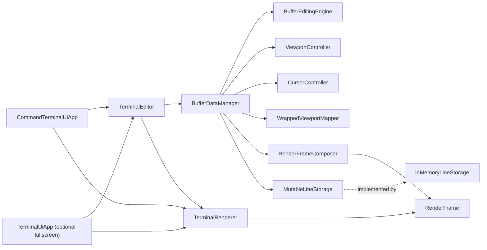
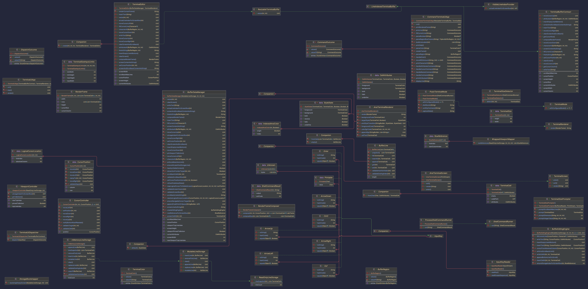

# Terminal Buffer

## Solution Overview

This project implements a terminal text buffer with screen + scrollback, cursor and attributes, editing operations, read APIs, resize support, and an interactive command UI.

The implementation is split into clear layers:

- Domain: cell, attributes, line, color, cursor primitives.
- Storage: canonical logical-line persistence.
- Manager: runtime state and buffer behavior.
- Editor: public contract entry point.
- Renderer: pure `RenderFrame -> String` conversion.
- UI: command-driven terminal runtime built on the editor contract.

## Architecture

### Component Split



### Responsibility Boundaries

- `TerminalEditor`
  - Single public entry point (`TerminalBufferContract` + resize contract).
  - Delegates mutation/read state to manager.
  - Delegates rendering to `TerminalRenderer`.
- `BufferDataManager`
  - Owns screen config, cursor position, current attributes, viewport state.
  - Applies cursor and viewport invariants.
  - Owns read APIs and frame composition.
  - Delegates edit algorithms to `BufferEditingEngine`.
- `BufferEditingEngine`
  - Implements write/insert/fill/insert-empty-line mutations using canonical logical lines.
- `InMemoryLineStorage`
  - Persists canonical logical lines (`ArrayDeque<BufferLine>`).
  - Width-agnostic; no wrapping, no viewport logic.
  - Defensive-copy writes and snapshot reads.

Collection choice note:
- Array-backed collections are used for indexed line/cell operations (read/set/insert by position).
- `ArrayDeque` is used at the storage boundary to support scrollback behavior efficiently (append newest line, trim oldest line).
- `AnsiTerminalRenderer`
  - Consumes immutable `RenderFrame` only.
  - Produces ANSI output and cursor highlight.
- `CommandTerminalUiApp`
  - Interactive command shell using buffer contract APIs.
  - Renders a bordered frame and prints cursor/size metadata.

### Dependency Injection Notes

- `TerminalEditor` receives `BufferDataManager` and `TerminalRenderer` via constructor injection.
- `BufferDataManager` receives `MutableLineStorage` via constructor injection.
- `CommandTerminalUiApp` receives `ResizableTerminalBuffer`, `TerminalRenderer`, and I/O streams via constructor injection.
- `TerminalUiApp` (optional fullscreen path) receives buffer, renderer, input parser, terminal mode handler, and screen adapter via constructor injection.
- `TerminalSizeDetector` receives a `ShellCommandRunner`, enabling deterministic tests without running real shell commands.

DI intent:
- keep modules isolated by contracts,
- make behavior testable with fakes/stubs,
- keep runtime wiring centralized in composition roots (`main` and `TerminalEditor.create`).

## Data Model and Contracts

### Domain Model

- `TerminalColor`: `DEFAULT` + 16 ANSI colors.
- `CellAttributes`: foreground/background + bold/italic/underline.
- `TerminalCell`: `codePoint: Int?` + attributes.
- `BufferLine`: mutable logical line of `TerminalCell` values.
- `CursorPosition`: non-negative `(column, row)` with helper movement/clamping.

Color representation note:
- Core buffer stores semantic color values (`TerminalColor`) only.
- Renderer implementations are responsible for converting those values to concrete output codes (for example ANSI SGR sequences).

### Storage Contracts

- `ReadOnlyLineStorage`
  - `lineCount`
  - `lineSnapshot(index)`
- `MutableLineStorage`
  - `appendLine`, `insertLine`, `replaceLine`, `mutableLine`, `removeFirstLine`, `clear`

Contract rules used by implementation:
- invalid indices fail fast,
- read snapshots are detached,
- write inputs are defensively copied,
- retention policy is manager-owned.

### Public Buffer and Render Contracts

- `TerminalBufferContract` exposes setup state, attributes, cursor, editing, content access, and `composeRenderFrame()`.
- `ResizableTerminalBuffer` adds in-place `resize(width, height)`.
- `TerminalRenderer` consumes only `RenderFrame`.

### Code Diagram



## Key Design Decisions and Trade-offs

1. Canonical storage is logical-line based (not screen-width based).
   - Why: preserves content independent of viewport size.
   - Trade-off: wrapping/reflow must be computed at view time.

2. Wrapping/reflow is render/viewport mapping behavior, not storage mutation.
   - Why: resize can preserve canonical content.
   - Trade-off: mapping logic is more complex than fixed physical rows.

3. Manager owns cursor and viewport invariants.
   - Why: one place for state rules and validation.
   - Trade-off: manager is orchestration-heavy (offset by extracted internal collaborators).
   - Note: `BufferDataManager` still ended up too large and too central; this is acknowledged technical debt.

4. Renderer is frame-only.
   - Why: strict SRP and safe, testable rendering.
   - Trade-off: requires composing a `RenderFrame` on each render path.

5. UI remains contract-driven.
   - Why: behavior rules stay in buffer core, not duplicated in UI.
   - Trade-off: UI must handle contract exceptions and present clear command errors.

## Behavior Decisions

### Setup

- Configurable `screenWidth`, `screenHeight`, `scrollbackMaxLines`.
- Startup validates positive dimensions and non-negative scrollback.

### Attributes

- Current attributes are manager-owned and applied by subsequent edits.

### Cursor

- Cursor movement is screen-bounded.
- Destination validation prevents navigation into arbitrary empty regions when content exists.
- Insertion-frontier positions are allowed so users can return to "after last character" positions.

### Editing

- `writeText(text)`
  - overwrite semantics at current cursor,
  - updates cells in canonical logical line,
  - cursor advances by written length in wrapped coordinates.
- `insertText(text)`
  - insert semantics at current cursor (shift-right in logical line),
  - cursor advances similarly in wrapped coordinates.
- `fillCurrentLine(character)`
  - fills visible row segment width with one character or empty cell.
- `insertEmptyLineAtBottom()`
  - appends a new empty logical line at bottom-visible region.
- `clearScreen()`
  - clears visible area while preserving scrollback.
- `clearScreenAndScrollback()`
  - resets both visible and historical content.

### Screen/Scrollback Read APIs

- Character and attributes lookup for `SCREEN` and `SCROLLBACK`.
- Line extraction and aggregate string dumps:
  - screen only,
  - screen + scrollback.

### Resize

- Resize is in-place and preserves canonical content.
- Cursor remaps by logical wrapped position (`lineIndex + absoluteColumn`) and falls back to clamping only when logical mapping is unavailable.

### UI Rendering Convention

- Command UI displays empty cells as `.` for visibility.
- Output is bordered and includes `cursor=(c,r) size=WxH` status line.

## Testing Strategy and Quality

The project uses TDD-style, boundary-focused unit tests.

Coverage focus:
- domain invariants,
- storage contracts and defensive-copy/snapshot guarantees,
- manager state, editing, viewport mapping, resize behavior,
- editor delegation and contract behavior,
- renderer correctness,
- UI command dispatch and lifecycle behavior.

Quality gate command:

```bash
./gradlew format lint test
```

Latest local validation in this workspace: all tests pass.

## Build, Test, and Run

Prerequisite:
- JDK 25

Build and test:

```bash
./gradlew format lint test
./gradlew test
```

Run application:
- Start `terminalbuffer.MainKt` from IDE (`src/main/kotlin/terminalbuffer/Main.kt`).
- Enter startup width/height and scrollback max lines in the prompt.
- Type `help` in the command loop for available operations.

## Implementation notes

- No custom characters/glyph sets are supported.
- Text cells store standard Unicode code points only.
- Other functionality is implemented

## Authorship Note

Most of the UI layer and a large portion of the documentation were written with AI assistance.
